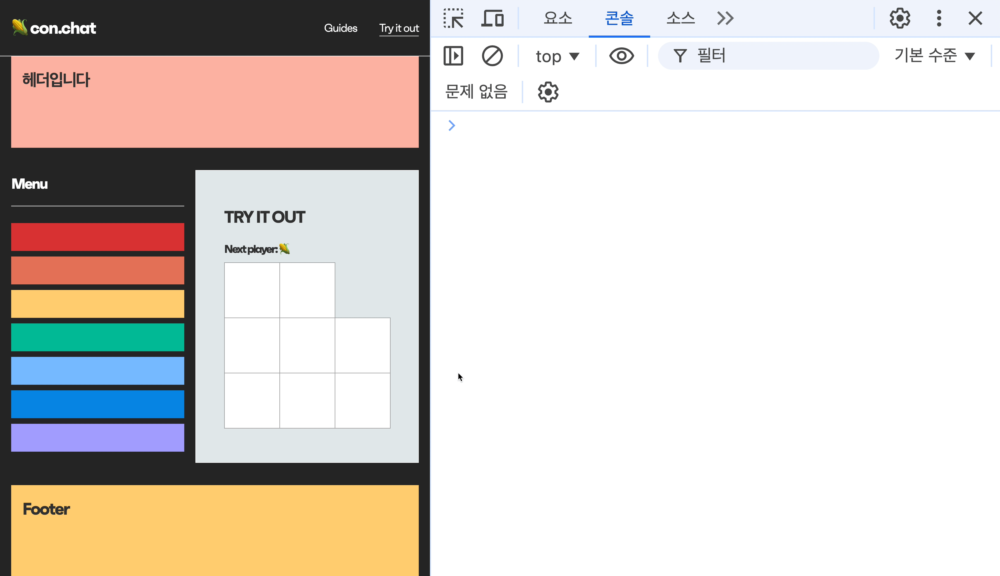

# 🌽con.chat

<p align="center">
  
</p>

<div align="center">
con.chat은 <b>브라우저 개발자 도구의 콘솔창</b>을 이용하여 동일한 웹사이트를 <br>사용하고 있는 유저들 간에 <b>실시간 채팅</b> 서비스를 제공하는 라이브러리입니다. <br>
또한 Javascript 또는 React로 개발된 웹사이트에서 언어별 메서드를 이용한 <br><b>DOM 조작</b> 및 <b>컴포넌트 트리 비교</b> 기능을 통해 간편한 디버깅 환경을 제공합니다.

<br><br>

<a href="https://con-chat.com/">Guide Website</a> | <a href="https://github.com/Team-macoss/con.chat">CDN Repository</a> | <a href="https://github.com/Team-macoss/con.chat-guide">Guide Repository</a>

</div>

<br><br>

## 목차

- [**🌽 con.chat**](#con.chat)
- [**기획 동기**](#기획-동기)
- [**기술 스택**](#기술-스택)
- [**기능 미리보기**](#기능-미리보기)
- [**개발 과정에서 고민한 부분들**](#개발-과정에서-고민한-부분들)
  1. [콘솔창에 드러난 메서드 내부 로직의 은닉화](#1-콘솔창에-드러난-메서드-내부-로직의-은닉화)
  2. [상대로부터 전송받은 script 코드는 과연 안전할까?](#2-상대로부터-전송받은-script-코드는-과연-안전할까)
  3. [다양한 DOM 메서드를 데이터베이스에서 어떻게 구분할까?](#3-다양한-dom-메서드를-데이터베이스에서-어떻게-구분할까)
  4. [변경사항을 적용할 요소를 상대에게 어떻게 전달할 수 있을까?](#4-변경사항을-적용할-요소를-상대에게-어떻게-전달할-수-있을까)
  5. [이미 렌더링 된 DOM으로 부터 어떻게 리액트 컴포넌트 정보를 알 수 있을까?](#5-이미-렌더링-된-dom으로-부터-어떻게-리액트-컴포넌트-정보를-알-수-있을까)
- [**회고**](#회고)

<br><br>

## 기획 동기

팀원 모두가 웹 퍼블리셔로서의 근무 경험이 있어, 웹 페이지의 스타일과 구조를 조정하고, 동적으로 변경하며 개발자 도구를 이용한 디버깅 경험이 많았습니다. 하지만 이러한 업무들은 개별적인 작업으로 팀원들에게 공유하기 어렵습니다.

**브라우저 개발자 도구의 기능을 충분히 활용하며, 실시간으로 디버깅 사항을 공유할 수는 없을까?** 라는 호기심에서 출발하여 `con.chat` 프로젝트를 기획하게 되었습니다.

`con.chat`은 실시간 채팅을 통해 협업할 수 있는 도구로, 브라우저에서 개발자 도구를 사용하는 것처럼 DOM을 실시간으로 조작하고, 리액트 컴포넌트 트리를 분석할 수 있는 기능을 제공합니다. 이를 통해 얻을 수 있는 근본적인 이점은 다음과 같습니다.

1. **의사소통 강화**: 팀원들이 실시간으로 같은 화면을 보며 문제를 논의하고 해결할 수 있어, 오해나 불필요한 커뮤니케이션을 줄일 수 있습니다.
2. **디버깅 용이성**: 리액트 애플리케이션의 경우, 컴포넌트 트리 구조의 차이를 시각적으로 확인 가능하며, 같은 애플리케이션 내에서 컴포넌트 간의 정보 비교를 통해 버그의 원인을 빠르게 파악할 수 있도록 합니다.

<br><br>

## 기술 스택

### Client


<!-- <details>
<summary>SCSS 도입 이유</summary>
<br>
scss 사용한 이유 작성하기

</details> -->

### Server


<details>
<summary>📡 Socket.io 대신 Firebase Realtime Database를 도입한 이유</summary>
<br>
Firebase의 Realtime Database는 데이터 베이스 변경 사항을 실시간으로 반영할 수 있습니다. 채팅 서비스를 구현하기 위한 핵심 기능으로, 사용자 간의 메시지 송수신을 즉각적으로 반영할 수 있습니다.

<br>

또한 Firebase는 서버를 직접 관리하지 않아도 되는 서버리스 환경을 제공합니다. 콘챗은 콘솔에서 유저 간의 메시지를 송수신하며 서로의 DOM 조작을 통한 디버깅 서비스가 주요 기능이었기 때문에 복잡한 비즈니스 로직이 필요하지 않습니다. 따라서 서버리스 환경의 개발이 필요했고, 이외에도 배포 및 호스팅 등 Firebase가 제공하는 다양한 기능적 이점을 활용하기 위해 Firebase를 선택했습니다.

</details>

### Test


### Deployment


<br><br>

## 기능 미리보기

### 1. 채팅 시작

<details>
<summary>
  화면 보기
</summary>
  <br>
  
</details>

- `con.chat`: 채팅을 시작합니다.
- `con.setLanguage('언어')`: 채팅 언어를 js 또는 react로 설정합니다.
- `con.configUsername('유저명')`: 사용자 이름을 설정합니다.
- `con.speak('메시지')`: 사용자에게 메시지를 전송합니다.

<br>

### 2. 채팅방 만들기

<details>
<summary>
  화면 보기
</summary>
  <br>
  <p>❗️ User 1과 User 2가 실시간으로 채팅하는 영상입니다. 두 개의 화면을 함께 확인해주세요!</p>
  <h4>🙎‍♀️ User 1</h4>
  
  <h4>🙎‍♂️ User 2</h4>
  
</details>

- `con.createDebugRoom('방이름')`: 디버깅 방을 생성합니다. 고유한 키가 생성됩니다.
- `con.enterDebugRoom('방이름', '방의 고유한 키')`: 디버깅 방에 입장합니다. 방 이름과 키가 일치해야 합니다.
- `con.listRooms()`: 모든 디버깅 방의 목록을 조회합니다.
- `con.leaveDebugRoom()`: 디버깅 방에서 나갑니다.

<br>

### 3. DOM 조작

#### 3-1. 스타일 수정, 요소 삽입

<details>
<summary>
  화면 보기
</summary>
  <br>
  <p>❗️ User 1과 User 2가 실시간으로 채팅하는 영상입니다. 두 개의 화면을 함께 확인해주세요!</p>
  <h4>🙎‍♀️ User 1</h4>
  
  <h4>🙎‍♂️ User 2</h4>
  
</details>

- `con.changeStyle('color: red;')`: 개발자 도구에서 클릭한 요소의 스타일을 변경합니다.
- `con.insertElement(element, 'position')`: 개발자 도구에서 클릭한 요소의 주변으로 element를 지정된 위치에 삽입합니다.

#### 3-2. 텍스트 변경, 속성 변경, 요소 삭제

<details>
<summary>
  화면 보기
</summary>
  <br>
  <p>❗️ User 1과 User 2가 실시간으로 채팅하는 영상입니다. 두 개의 화면을 함께 확인해주세요!</p>
  <h4>🙎‍♀️ User 1</h4>
  
  <h4>🙎‍♂️ User 2</h4>
  
</details>

- `con.removeElement(element)`: element 또는 개발자 도구에서 클릭한 요소를 삭제합니다.

<br>

### 4. React 컴포넌트 트리 조회 및 비교

#### 4-1. 컴포넌트 트리 조회

<details>
<summary>
  화면 보기
</summary>
  <br>
  
</details>

- `con.showComponentTree()`: 해당 페이지의 리액트 컴포넌트 트리를 보여줍니다.
- `con.serachComponents('컴포넌트명')`: 컴포넌트의 이름을 검색하여 DOM 요소를 확인합니다.

#### 4-2. 컴포넌트 트리 비교

<details>
<summary>
  화면 보기
</summary>
  <br>
  <p>❗️ User 1과 User 2가 실시간으로 채팅하는 영상입니다. 두 개의 화면을 함께 확인해주세요!</p>
  <h4>🙎‍♀️ User 1</h4>
  
  <h4>🙎‍♂️ User 2</h4>
  
</details>

- `con.shareComponentTree('유저명')`: 리액트 컴포넌트 트리를 비교합니다. 발신자와 수신자의 state와 props를 비교합니다.

<br>

### 5. 채팅 가이드 및 채팅 종료

<details>
<summary>
  화면 보기
</summary>
  <br>
  
</details>

- `con.showGuide()`: con.chat 사용 가이드를 보여줍니다.
- `con.close()`: 채팅을 종료합니다.

<br/><br/>

## 개발 과정에서 고민한 부분들

## 1. 콘솔창에 드러난 메서드 내부 로직의 은닉화

### 1-1. 클래스형 vs 함수형 접근 방식 비교

con.chat 프로젝트를 설계할 때, 클래스형과 함수형의 접근 방식 중 어떤 것을 선택할지 두 방식의 특징을 비교해보며, con.chat에 가장 적합한 방식을 찾고자 했습니다.

**클래스형 접근 방식**

장점
1. **코드 구조화와 캡슐화**: 클래스를 사용하면 관련 데이터와 기능을 하나의 단위로 묶을 수 있어 코드 구조화가 용이합니다. 이는 con.chat과 같이 복잡한 상태와 기능을 다루는 프로젝트에 특히 유용합니다.

2. **상속과 확장성**: 클래스 상속을 통해 코드 재사용과 기능 확장이 쉽습니다.

3. **this 컨텍스트**: 클래스 내에서 this 키워드를 사용하여 인스턴스의 속성과 메서드에 쉽게 접근할 수 있습니다. 이는 con.chat에서 사용자 상태, 채팅방 정보 등을 관리하는 데 유용합니다.

4. **생명주기 관리**: 클래스의 constructor, 메서드 등을 활용하여 객체의 생성, 초기화, 소멸 과정을 명확하게 관리할 수 있습니다. 이는 채팅 세션의 시작과 종료를 관리하는 데 도움이 됩니다.

단점
1. **복잡성**: 클래스 구조가 커질수록 코드가 복잡해질 수 있으며, 상속 관계가 깊어지면 코드 이해와 유지보수가 어려워질 수 있습니다.

2. **this 바인딩 이슈**: JavaScript의 this 동작 방식으로 인해 메서드를 다른 컨텍스트에서 호출할 때 바인딩 문제가 발생할 수 있습니다.

**함수형 접근 방식**

장점
1. **코드 간결성**: 함수형 프로그래밍은 일반적으로 더 간결하고 읽기 쉬운 코드를 작성할 수 있게 해줍니다. 이는 con.chat의 복잡한 로직을 더 명확하게 표현하는 데 도움이 될 수 있습니다.

2. **순수 함수와 예측 가능성**: 부작용을 최소화하고 순수 함수를 사용함으로써 코드의 예측 가능성과 테스트 용이성이 향상됩니다. 이는 con.chat의 메시지 처리나 상태 업데이트 로직에 적용될 수 있습니다.

3. **함수 합성**: 작은 함수들을 조합하여 복잡한 동작을 만들 수 있습니다. 이는 con.chat의 다양한 채팅 기능들을 모듈화하고 조합하는 데 유용할 수 있습니다.

4. **불변성과 부수 효과 최소화**: 함수형 프로그래밍은 불변성을 강조하고 부수 효과를 최소화하여 예측 가능하고 안정적인 코드를 작성하는 데 도움을 줍니다.

단점
1. **상태 관리의 복잡성**: 순수 함수형 프로그래밍에서는 상태 관리가 더 복잡할 수 있습니다. con.chat과 같이 복잡한 상태를 다루는 애플리케이션에서는 이 점을 주의깊게 고려해야 합니다.

2. **성능 고려사항**: 불변성을 유지하기 위해 새로운 객체를 생성하는 과정이 필요할 수 있어, 메모리 사용량이 증가할 수 있습니다.

### 1-2. con.chat에서의 클래스형 선택 이유

다음과 같은 이유로 클래스형 접근 방식을 선택했습니다.

1. **상태 관리의 용이성**: 채팅 애플리케이션의 특성상 다양한 상태(사용자 상태, 현재 채팅방, 메시지 히스토리 등)를 관리해야 했습니다. 클래스 인스턴스를 통해 이러한 상태를 효과적으로 관리할 수 있었습니다.

   ```javascript
   class Con {
     #state = false;
     #language = null;
     #username = DEFAULT_USER_NAME;
     #currentRoomKey = PUBLIC_ROOM_KEY;
     // ...
   }
   ```

2. **캡슐화와 정보 은닉**: 클래스의 private 필드와 메서드를 사용하여 내부 구현을 효과적으로 숨길 수 있었습니다. 이는 콘솔 환경에서 사용자가 직접 접근하면 안 되는 중요한 메서드들을 보호하는 데 도움이 되었습니다.

   ```javascript
   class Con {
     #sendMessageAsync(roomId, content, type = 'text') {
       // 내부 구현...
     }
   }
   ```

3. **확장성**: 클래스 구조는 향후 기능 확장에 유리할 것으로 판단했습니다. 예를 들어, 크롬 익스텐션으로 확장할 경우 기존 클래스를 확장하거나 새로운 클래스를 추가하여 브라우저 특화 기능을 쉽게 구현할 수 있습니다.

   ```javascript
   class ChromeExtensionCon extends Con {
     injectContentScript() {
       // 크롬 익스텐션 관련 기능 구현
     }

     handleBrowserEvents() {
       // 브라우저 이벤트 처리
     }
   }
   ```

4. **코드 구조화와 관리**: 클래스를 사용함으로써 관련 기능과 상태를 논리적 단위로 그룹화할 수 있었습니다. 이는 프로젝트가 커짐에 따라 코드의 가독성과 유지보수성을 높이는 데 도움이 되었습니다.

   ```javascript
   class Con {
      // 채팅 관련 메서드
      chat() { /* ... */ }
      speak(message) { /* ... */ }

      // 룸 관리 관련 메서드
      createDebugRoom(roomName) { /* ... */ }
      enterDebugRoom(roomName, roomKey) { /* ... */ }
      leaveDebugRoom() { /* ... */ }

      // DOM 조작 관련 메서드
      changeStyle(styleCode) { /* ... */ }
      changeText(text) { /* ... */ }
      setAttribute(attrName, attrValue) { /* ... */ }

      // React 컴포넌트 관련 메서드
      showComponentTree() { /* ... */ }
      shareComponentTree(username) { /* ... */ }
    }
   ```

이러한 이유들로 인해 con.chat 프로젝트에서는 클래스 기반 접근 방식이 더 적합하다고 판단하였습니다.

### 1-3. 문제 인식 및 원인: 메서드 내부 로직 노출 문제

클래스형 접근 방식을 채택한 후, 예상치 못한 문제에 직면했습니다. <br>
메서드 내부의 로직이 콘솔창에 노출되어, 사용자가 의도치 않게 내부 로직에 접근할 수 있는 문제가 발생한 것입니다.

<p align="center">
<br>
<i>콘솔창에서 클래스 메서드 사용 시 내부 로직이 노출되는 모습</i>
</p>
<br/>

예를 들어, 'isValidLanguage' 메서드는 선택한 언어가 유효한지 확인하는 로직을 담고 있지만, <br>
사용자가 이를 확인할 필요가 없었습니다. 이는 보안과 사용성 측면에서 문제가 되었습니다. <br><br>
문제의 원인을 분석해보니, 메서드 내부의 하위 로직들이 적절히 은닉화되지 않아 콘솔창에서 쉽게 접근할 수 있었던 것이었습니다.

### 1-2. 해결 방안 모색: 클래스형 은닉화를 통한 문제 해결

이 문제를 해결하기 위해, 클래스형 프라이빗 필드 문법을 사용하여 내부 로직을 은닉화하기로 결정했습니다. <br> 이 방법을 통해 객체 지향의 일관성을 유지하면서도, 필요한 부분만 외부에 노출시킬 수 있었습니다. <br><br>
예를 들어, 사용자 이름을 설정하는 '#updateUserName' 메서드를 다음과 같이 클래스 내부에서 은닉화했습니다.

```jsx
async #updateUserName(username) {
  const userRef = this.#getRef(`chats/users/${this.#userKey}`);

  await update(userRef, { username }).catch((error) => {
    console.error('Error updating username:', error);
  });

  this.#username = username;
  this.#hasUsername = true;
}
```

이러한 접근 방식을 통해 다음과 같은 이점을 얻을 수 있었습니다.

- 내부 로직의 보안 강화
- 사용자 인터페이스의 단순화
- 코드의 모듈성과 재사용성 향상
- 향후 기능 확장 시 유연성 확보

결과적으로, 클래스형 은닉화를 통해 con.chat의 기능을 효율적으로 관리하고 확장할 수 있는 구조를 구현할 수 있었습니다.

<br>

## 2. 상대로부터 전송받은 script 코드는 과연 안전할까?

### 2-1. 초기 접근 방식: script 코드를 직접 전송하여 상대측에서 해당 코드를 실행하게 하자!

DOM 조작 기능에 대한 구현 방법을 고안할 때, 첫 번째로 떠올렸던 방법은 script 코드를 메서드의 인자(문자열)로 전달하면 상대측은 수신한 문자열을 `new Function` 문법을 이용하여 해당 코드를 실행 시키도록 하는 것이었습니다. 예를 들어, 다음과 같은 방식으로 DOM 조작이 이루어질 수 있습니다.

```jsx
// 사용자 A가 입력한 DOM 조작 코드
con.applyScriptCode("document.body.style.background-color = 'tomato';");

// 사용자 B가 해당 코드를 실행
new Function("document.body.style.background-color = 'tomato';")();
```

이 방식은 사용자에게 높은 자유도를 제공할 수는 있지만, 치명적인 보안 문제를 일으킬 수 있습니다.
특히, XSS(Cross Site Scripting) 공격에 매우 취약하다는 문제점이 있었습니다.

<details>
<summary>
  <b>💡 XSS(Cross Site Scripting) 란?</b>
</summary>
<br/>
<blockquote style="margin-left: 20px">
  XSS 공격은 웹 애플리케이션에서 발생할 수 있는 주요 보안 취약점 중 하나로, 공격자가 악성 스크립트를 다른 사용자의 브라우저에서 실행시킬 수 있는 문제를 의미합니다.
</blockquote>
</details>

<br/>

**💭 사용자 A가 전송한 코드가 무한 루프에 빠질 수 있는 코드라면?**

**💭 사용자 A가 사용자 B의 쿠키를 탈취하는 코드를 삽입하여 사용자 B의 세션 정보나 로그인 토큰 등 중요한 정보가 노출될 수 있다면?**

만약, 저희가 처음 고안한 방법대로라면 사용자 B가 전혀 인지하지 못한 사이에 악성 스크립트가 실행될 수 있는 위험에 처합니다. 그렇다면 수신자의 입장에서 안전한 코드 만을 실행시킬 수 있는 근본적인 방법은 무엇일까요?

### 2-2. 안전한 코드 실행을 보장하는 방법: DOM 조작에 필요한 메서드 제공

저희가 생각해낸 해결책은 사용자의 자유도에 일부 제약을 주되, DOM 조작에 필요한 메서드를 직접 정의하여 제공하는 것이었습니다. 이 방법을 통해 허용된 DOM 조작 만을 수행하도록 할 수 있으며, 예기치 않은 악성 코드 실행을 방지할 수 있었습니다.

- **정의된 DOM 조작 메서드 예시**

  ```jsx
  class Con {
    changeStyle(styleCode) {
      // styleCode가 CSS 코드인지 검증하는 로직
      // 메서드 구현 로직
      // ..
    }
  }

  window.con = new Con();
  ```

  ```jsx
  // 사용자 A가 콘솔창에 아래의 코드를 입력하여 사용자 B의 DOM 요소에 CSS 변경사항을 적용
  con.changeStyle('background-color: tomato;');

  // 사용자 B의 DOM element에 styleCode 적용
  // CSSOM의 인스턴스 프로퍼티를 이용하여 CSS 적용
  element.style.cssText += styleCode;
  ```

<details>
<summary>
  <b>💡 대상 <code>element</code>는 어떻게 설정될까요?</b>
</summary>
<br/>
<blockquote style="margin-left: 20px">
  기본적으로 `element`는 사용자가 개발자 도구의 요소 탭에서 클릭하여 선택한 요소로 설정됩니다.
  이는 개발자 도구를 활용한 채팅이라는 점에서 개발자 도구의 다양한 기능을 활용하면서 사용자에게 편의를 주기 위함이었습니다.
  어떻게 발신자 측에서 선택한 `element`를 수신자 측에서도 동일한 `element`를 참조할 수 있도록 했는지에 대한 내용은 <a href="#4-변경사항을-적용할-요소를-상대에게-어떻게-전달할-수-있을까"><b>4. 변경사항을 적용할 엘리먼트를 상대에게 어떻게 전달할 수 있을까?</b></a>에서 자세히 설명하겠습니다.
</blockquote>
</details>

<br/>

각각의 DOM 조작 메서드는 사용자의 변경 요소 선택 여부와 인자의 성격에 따라 유효성을 검증하는 로직을 포함하여 사용자가 의도하는 변경 사항만을 적용할 수 있도록 처리 하였으며, 수신자 측에서는 Javascript의 네이티브 프로퍼티 또는 메서드로 `element`에 변경 사항을 적용합니다.

위의 예시 코드로 설명을 하자면, `cssText`는 Javascript에서 CSS 스타일을 변경할 수 있는 CSSOM 프로퍼티 입니다. Javascript에 내장된 DOM, CSSOM 관련 프로퍼티와 메서드를 이용함으로써 임의의 Javascript 코드가 실행되는 것을 방지하고, 오직 CSS 스타일만 변경되도록 보장합니다.

모든 DOM 조작 메서드는 이러한 방법으로 발신자 측에서는 대상이 될 `element`와 코드에 대한 유효성 검증을 마친 후 상대방에게 메시지를 전송하게 되며, 수신자 측에서는 저희가 미리 정의 해둔 로직 만을 처리하기 때문에 XSS 문제를 해결할 수 있었습니다.

### 2-3. 사용성 개선을 위한 고민: 가이드 페이지 제공

사용자들은 con.chat이 제공한 각기 다른 DOM 조작 메서드를 학습해야 합니다. 이는 사용자의 학습 곡선의 증가로 이어집니다. 이 문제에 대한 고민 결과, MDN 문서처럼 사용자들에게 con.chat의 메서드를 모두 정리하여 제공하면 도움이 되지 않을까? 라는 생각을 하게 되었습니다. 저희는 사용자에게 가이드 페이지를 제공하여 각 메서드에 대한 명세를 작성하여 사용자들이 쉽게 접근할 수 있도록 했습니다. 또한 각 메서드의 사용 예제를 제공하여, 사용자가 실제로 어떻게 메서드를 활용할 수 있는지 보여주어 사용자들이 빠르게 메서드를 적용할 수 있도록 했습니다.

<br>

## 3. 다양한 DOM 메서드를 데이터베이스에서 어떻게 구분할까?

con.chat의 핵심 기능 중 하나는 실시간으로 DOM 조작 메서드를 다른 사용자와 공유하는 것입니다. <br>
이를 위해 Firebase Realtime Database를 활용한 실시간 통신 메커니즘을 구현해야 했습니다.

### 3-1. 일반적인 채팅 서비스의 메커니즘 이해

먼저, 일반적인 채팅 서비스의 실시간 통신 메커니즘을 이해하는 것부터 시작했습니다. <br>
이는 con.chat의 기본 구조를 설계하는 데 중요한 기반이 되었습니다.

<div align="center">
  
</div>

일반적인 채팅 서비스에서는 사용자 A가 메시지를 전송하면 그 메시지가 데이터베이스에 저장됩니다. 데이터베이스의 변경사항은 실시간으로 다른 사용자들에게 동기화되며, 사용자 B를 포함한 다른 사용자들은 새로운 메시지를 수신하고 화면에 표시합니다. <br>
이러한 기본적인 메커니즘은 con.chat에서도 유사하게 적용되지만, 단순한 텍스트 메시지뿐만 아니라 DOM 조작 명령어도 이 흐름을 따라 전송되고 처리됩니다.

### 3-2. 초기 접근 방식: 개별 메서드 처리의 비효율성

처음에는 각 DOM 조작 메서드에 대해 개별적인 리스너를 만들어 처리하려 했습니다. <br>
이 접근 방식은 빠르게 구현할 수 있었지만, 여러 가지 문제점을 안고 있었습니다.

<div align="center">
  
</div>

각 메서드마다 유사한 리스너 로직이 반복되어 코드 중복이 발생했고, 새로운 DOM 조작 메서드를 추가할 때마다 새로운 리스너를 만들어야 해서 확장성이 떨어졌습니다. <br>
또한, 각 메서드 타입별로 다른 데이터 구조를 가지게 되어 데이터베이스 구조가 복잡해졌고, 많은 수의 리스너가 동시에 작동하면서 성능 저하를 초래할 수 있었습니다.

```javascript
#listenForTextMessages(roomId) {
  // 텍스트 메시지 처리 로직
}

#listenForStyleMessages(roomId) {
  // 스타일 변경 메시지 처리 로직
}

#listenForInsertElementMessages(roomId) {
  // DOM 요소 삽입 메시지 처리 로직
}
```

이 방식은 장기적으로 유지보수가 어렵고 확장성이 떨어지는 문제가 있었기 때문에, 더 효율적인 해결책을 모색해야 했습니다.

### 3-3. 해결 방안: 통합된 리스너와 일관된 데이터 구조

이러한 문제점들을 해결하기 위해, 통합된 메시지 리스너와 일관된 데이터 구조를 사용하는 새로운 접근 방식을 채택했습니다.

<div align="center">
  
</div>

새로운 접근 방식에서는 모든 타입의 메시지를 하나의 통합된 리스너로 처리합니다. <br>
모든 메시지는 동일한 기본 구조를 가지되, `type` 필드를 통해 구분됩니다. 메시지를 수신하면 해당 타입에 따라 적절한 처리 함수를 호출하는 방식으로 동작합니다.

```javascript
#listenForMessages(roomId) {
  const messagesRef = this.#getRef(`chats/messages/${roomId}`);

  this.#messageListener = onValue(messagesRef, (snapshot) => {
    snapshot.forEach((childSnapshot) => {
      const message = childSnapshot.val();

      switch(message.type) {
        case 'text':
          this.#handleTextMessage(message);
          break;
        case 'changeStyle':
          this.#handleStyleChange(message);
          break;
        case 'insertElement':
          this.#handleElementInsertion(message);
          break;
        // 다른 타입의 메시지 처리...
      }
    });
  });
}

#sendMessage(roomId, content, type) {
  const messagesRef = this.#getRef(`chats/messages/${roomId}`);
  const newMessage = {
    username: this.#username,
    content,
    timestamp: Date.now(),
    type,
  };
  push(messagesRef, newMessage);
}
```

이 새로운 접근 방식을 통해 코드 중복을 크게 줄일 수 있었고, 새로운 메시지 타입을 쉽게 추가할 수 있는 확장성을 확보했습니다. 모든 메시지가 동일한 기본 구조를 가지게 되어 데이터베이스 구조도 단순화되었으며, 단일 리스너 사용으로 리소스 사용 효율성도 개선되었습니다.

이러한 설계를 통해 다양한 DOM 조작 메서드를 효율적으로 처리하고, 실시간으로 다른 사용자와 공유할 수 있는 시스템을 구축할 수 있었습니다.

<br>

## 4. 변경사항을 적용할 요소를 상대에게 어떻게 전달할 수 있을까?

### 4-1. 개발자 도구의 기능 활용

초기 기획 단계에서 반드시 검증을 해야했던 기능 중 하나는,

**사용자 A가 디버깅을 위해 지정한 요소를 사용자 B 또한 동일한 요소를 참조하도록 해야한다**는 것이었습니다.

저희는 사용자 편의성을 위해 DOM 조작 메서드를 사용하기 위한 전제 조건을 설정하였습니다. 사용자는 DOM 조작 메서드를 실행 하기 전에, 개발자 도구의 요소 탭을 이용하여 조작 대상이 될 요소를 클릭하여 선택해야한다는 것입니다. 이러한 과정이 사용자에게 제한을 주는 것은 아닐까 하는 고민이 있었지만, 오히려 이런 방법을 채택하기 전에는 대상 요소를 `document.querySelector` 등 Javascript의 선택자 API를 이용해 사용자가 일일이 지정해주어야 하는 번거로움이 있었습니다. 따라서 콘솔창을 이용한 채팅 서비스라는 목적성에 부합하게 개발자 도구의 기능을 충분히 활용하는 방안으로 결정하게 되었습니다.

사용자가 개발자 도구 요소 탭에서 요소를 직접 선택하는 행위는 곧 `$0` 이라는 요소 참조를 생성합니다.

<details>
<summary>
  <b>💡 개발자 도구의 <code>$0</code> 이란?</b>
</summary>
<br/>
<blockquote style="margin-left: 20px">
  개발자 도구의 <code>$0</code> 은 개발자 도구에서 <b>마지막으로 선택한 요소를 참조</b>하는 단축키입니다. <br/>
  이를 콘솔에서 직접 조작할 수 있습니다.
</blockquote>

<br/>
<center></center>
<center><i><code>$0</code> 변수가 ul.sidebar-menu 를 참조하고 있는 모습</i></center>
</details>

<br/>

하지만 `$0` 변수는 발신자의 로컬 환경에서만 유효한 식별자입니다. 이를 다른 사용자에게 전달한다고 해서 동일한 요소를 식별할 수 있는 방법은 없습니다. 따라서 저희는 `$0`을 고유한 식별자로서 전달하는 방법을 생각해내야 했습니다. 저희는 이러한 문제를 XPath 라는 개념을 활용하여 해결하였습니다.

### 4-2. 발신자의 $0를 XPath로 변환하기

**XPath**란 XML Path Language를 의미하며, XML 문서의 구조를 탐색하고 선택하기 위한 쿼리 언어입니다. XPath는 경로 표현식을 사용하여 문서의 특정 노드를 나타낼 수 있습니다. 웹 브라우저는 HTML 문서를 파싱하여 DOM을 생성하며 생성된 DOM은 결국 XML의 구조와 유사한 트리구조로 표현됩니다. 따라서 XPath 개념을 DOM에 적용하여 DOM 트리를 탐색하고 특정 요소를 경로 표현식으로 변환할 수 있었습니다.

<details>
<summary>
  <b>💡 XML과 HTML</b>
</summary>
<br/>
<blockquote style="margin-left: 20px">
  <b>XML</b><br>
  데이터 저장 및 전송을 위한 언어로, 사용자 정의 태그를 사용하여 구조화된 데이터를 표현합니다.
  <br><br>
  <b>HTML</b><br>
  웹페이지의 구조와 콘텐츠를 정의하는 언어로 미리 정의된 태그를 사용하여 텍스트, 이미지, 링크 등을 표현합니다. <br><br>
  두 언어 모두 태그를 사용하여 데이터를 구조적으로 표현하며, 요소와 속성을 사용하여 데이터를 정의하고 트리 구조를 형성합니다.
</blockquote>
</details>

<br/>

저희는 $0이 참조하는 요소를 XPath로 반환하는 재귀 함수를 구현하였습니다. 이 함수는 대상 요소에서 시작하여 루트 노드까지 재귀적으로 부모 노드를 탐색합니다. 결론적으로 각 부모 노드의 경로를 조합하여, 문서의 루트 노드(/html/body/) 또는 고유 식별자를 가진 요소(대상 요소의 부모 요소 중 ID를 가진 요소)부터 시작하여 대상 요소까지의 절대 경로를 문자열로 반환합니다.

<p align="center">
<br>
<i>로고를 담고 있는 a태그가 XPath로  변환되어 DB에 전송된 모습</i>
</p>
<br/><br/>

이제 수신자는 발신자가 선택한 요소를 XPath로서 동일한 요소를 참조할 수 있게 되었습니다. 수신자는 전달받은 XPath를 이용하여 다시 DOM 요소를 탐색하는 과정을 거쳐야 합니다. 이는 DOM API의 document.evaluate 메서드를 사용하여 XPath 평가할 수 있습니다. 결과적으로 발신자와 수신자는 동일한 요소를 참조하게 되고 각각의 클라이언트 환경에서 동일한 DOM 조작 로직을 처리하게 됩니다. 이로써, 실시간으로 DOM 조작을 동기화 하여, 여러 사용자 간의 인터페이스 공유를 실현할 수 있게 되었습니다.

<br>

## 5. 이미 렌더링 된 DOM으로 부터 어떻게 리액트 컴포넌트 정보를 알 수 있을까?

### 5-1. React 컴포넌트는 항상 React Fiber 속성을 가지고 있다!

con.chat의 핵심 기능 중 하나는 React 애플리케이션의 컴포넌트 트리를 시각화하여 보여주는 것입니다. 이 기능을 바탕으로 사용자 간의 트리 비교까지 수행하게 됩니다. 때문에 프로덕션 어플리케이션의 코드에 직접 접근하지 않고, 이미 화면에 렌더링된 DOM 요소로 부터 리액트 컴포넌트 정보를 알아낼 수 있는 방법이 필요했습니다. 이를 위해 다양한 방법을 모색해본 결과, 리액트 엘리먼트는 리액트 엘리먼트임을 나타내는 비공개 속성을 가지고 있다는 사실을 알게 됐습니다.

예를 들어,

<div>
<table style="border-collapse: collapse;">
  <tr>
    <td style="border-right: 1px solid #eee; padding-right: 10px;">_reactRootContainer</td>
    <td style="padding-left: 10px;">이 속성은 주로 React 애플리케이션의 루트 DOM 요소에 존재</td>
  </tr>
  <tr>
    <td style="border-right: 1px solid #eee; padding-right: 10px;">__reactFiber$…</td>
    <td style="padding-left: 10px;">React 16 이후의 Fiber 노드</td>
  </tr>
  <tr>
    <td style="border-right: 1px solid #eee; padding-right: 10px;">__reactContainer$…</td>
    <td style="padding-left: 10px;">이 속성은 주로 React의 포털(Portal) 요소에 존재</td>
  </tr>
</table>
</div>

등이 있으며 이러한 비공개 속성을 이용하여 리액트 Fiber Node에 접근할 수 있습니다.

<br>

### 5-2. 그래서 Fiber 노드로 어떻게 컴포넌트 트리를 그릴 수 있을까?

> [!NOTE]
> **Fiber? Fiber Node?** <br>
> React Fiber 노드는 React 16에서 도입된 React의 내부 재조정(reconciliation) 엔진의 핵심 개념입니다. <br>Fiber 아키텍처의 기본 작업 단위로, React 애플리케이션의 구조와 상태를 표현합니다.

쉽게 말해, Fiber 노드는 React 컴포넌트 트리의 내부 표현이며, 각 Fiber 노드는 컴포넌트 정보와 트리 구조를 표현하는 여러가지 속성을 가지고 있어, 이를 활용하여 컴포넌트 트리를 그릴 수 있었습니다.

아래는 렌더링된 DOM 트리의 최상위 요소로부터 탐색하여 실제 FiberNode를 콘솔창에 출력한 결과입니다. 저희가 처음 FiberNode를 마주했을 때는 객체 안에 굉장히 많은 속성들을 담고 있어, 저희가 구현하기 위한 기능(컴포넌트 트리 출력, 컴포넌트 트리 비교)을 위해 꼭 필요한 속성들이 무엇인지 정의하는 과정이 필요하다고 판단했습니다.

<p align="center">
<br>
<i>최상위 DOM 요소로 부터 FiberNode를 추출한 결과</i>
</p>

<br/>

Fiber 노드는 근본적으로 React의 렌더링 및 재조정 프로세스를 효율적으로 관리하기 위한 아키텍처로 작업 우선순위를 나타내는 `lanes`, `childLanes` 또는 side effects 유형을 나타내는 `effectTag`, 상태 및 속성을 나타내는 `memoizedProps`, `memoizedState`, `pendingProps` 등 매우 많은 속성이 존재합니다. <br> 
심지어 `child`, `return`, `sibling` 속성들은 중첩 객체가 포함되어 더욱 복잡한 구조를 가지고 있음을 확인했습니다. 하지만 속성명에서도 쉽게 알 수 있듯, 저희는 `child`와 `sibling` 속성이 컴포넌트 트리 정보를 가지고 있을 것이라는 추측을 하였고, 이 속성들에 대해 더욱 조사하게 되었습니다.

<div align="center">
<table style="border-collapse: collapse; width: 100%;">
  <tr>
    <th colspan="2" style="border: 1px solid #ddd; text-align: left;">Fiber 노드의 트리 구조 관련 속성</th>
  </tr>
  <tr>
    <td style="border: 1px solid #ddd; width: 150px;">child</td>
    <td style="border: 1px solid #ddd;">첫 번째 자식 Fiber 노드를 가리킴</td>
  </tr>
  <tr>
    <td style="border: 1px solid #ddd;">sibling</td>
    <td style="border: 1px solid #ddd;">다음 형제 Fiber 노드를 가리킴</td>
  </tr>
  <tr>
    <td style="border: 1px solid #ddd;">return</td>
    <td style="border: 1px solid #ddd;">부모 Fiber 노드를 가리킴</td>
  </tr>
</table>
</div>

<br>

조사 결과, 위의 속성들은 연결 리스트의 원리를 기반으로 설계 되었다는 점을 알 수 있었습니다. Fiber 노드 트리 구조의 유연한 탐색을 위해 단순한 트리 구조가 아닌 여러 개의 단방향 연결 구조를 갖고 있으며, 이러한 특징을 이용하면, 깊이 우선 탐색(DFS)을 통해 컴포넌트 트리를 출력할 수 있겠다는 가능성을 확인했습니다.

아래의 예시는 con.chat 가이드를 제공하는 웹 화면에서 볼 수 있는 샘플 레이아웃입니다. 실제 이 화면에 대한 컴포넌트 트리를 콘솔창에 그린다고 가정할 때,`child`, `sibling` 속성을 이용해 트리를 탐색하는 과정을 간략하게 설명드리겠습니다.


<p align="center">
<br>
<i>샘플 레이아웃 화면의 컴포넌트 구조</i>
</p>
<br>
<p align="center">
<br>
<i>샘플 레이아웃 화면의 리액트 컴포넌트 트리와 DOM 트리의 시각화</i>
</p>

<br>

#### 컴포넌트 트리 탐색 과정
1. FiberRootNode 찾기
- document.body에서 시작하여 React 루트 노드를 찾는다. React 루트 속성 `__reactContainer$` 을 가진 요소를 찾을 때 까지 DOM 트리를 재귀적으로 탐색.
2. Fiber 노드 찾기
- 1단계에서 찾은 루트 요소에서 Fiber 노드 추출.
3. 리액트 최상위 컴포넌트 찾기
- 2단계에서 얻은 Fiber 노드에서 'App'이름을 가진 최상위 컴포넌트를 우선적으로 탐색하고, 존재하지 않는다면 현재 컴포넌트 반환. (현재 컴포넌트가 곧 최상위 리액트 컴포넌트)
4. 전체 Fiber 트리 순회
- App` 컴포넌트부터 시작하여 전체 Fiber 트리를 순회하며 콘솔에 출력.
  - `type`, `type.name` 속성을 이용하여 컴포넌트명 식별
  - `stateNode` 속성을 활용하여 실제 DOM노드에 접근하여 DOM요소의 태그 이름, 내용 등을 확인하여 트리에 DOM을 함께 출력.

<br>

<p align="center">
<br>
<i>컴포넌트 트리 출력 결과</i>
</p>

<br>

### 5-3. Fiber 노드를 JSON으로 변환할 때의 문제

`con.shareComponentTree(username)` 메서드는 React 애플리케이션의 컴포넌트 트리를 시각화하고 사용자 간의 state와 props를 비교하는 메서드입니다. 이 메서드를 구현하는 과정에서 몇 가지 중요한 도전에 직면했습니다.

1. **문제 인식: 객체 구조 단순화**

`con.shareComponentTree(username)` 메서드를 구현하기 위해서는 지정된 사용자의 Fiber 객체를 JSON으로 변환하여 데이터베이스에 저장하는 과정이 필요했습니다. 하지만 React Fiber 객체는 매우 방대하고 복잡한 구조를 가지고 있어, 이를 그대로 JSON으로 변환하면 크기가 커지고 비효율적이었습니다.

이 문제를 해결하기 위해 필요한 정보만을 추출하여 새로운 객체에 담아 구조를 단순화하는 작업을 수행했습니다. 특히, 각 컴포넌트의 상태와 props를 추적하기 위해 `elementType`, `child`, `memoizedState`, `memoizedProps` 속성만을 선택적으로 추출했습니다.

이 속성들을 선택한 이유는 다음과 같습니다:
- `elementType`: 컴포넌트의 타입을 식별합니다.
- `child`: 컴포넌트 트리 구조를 유지하는 데 필요합니다.
- `memoizedState`: 컴포넌트의 현재 상태를 나타냅니다.
- `memoizedProps`: 컴포넌트에 전달된 props를 포함합니다.

이 네 가지 속성만으로도 컴포넌트 트리의 구조와 각 컴포넌트의 핵심 정보를 충분히 표현할 수 있었습니다.

<div align="center">
  <table>
    <tr>
      <td align="center"></td>
      <td align="center"></td>
    </tr>
    <tr>
      <td align="center">Fiber 객체</td>
      <td align="center">객체 구조 단순화</td>
    </tr>
  </table>
</div>

2. **JSON 변환 과정에서의 순환 참조 문제**

객체 구조를 단순화한 후, 이를 JSON으로 변환하려고 했을 때 순환 참조 에러라는 새로운 문제에 직면했습니다. 순환 참조란 객체가 직접 또는 간접적으로 자기 자신을 참조하는 상황을 말합니다.

이 문제는 Fiber 구조 내부에서 `useEffect` 훅과 같은 의존성 문제로 인해 참조가 계속 컴포넌트 자체를 가리키는 경우에 발생했습니다. JSON.stringify 함수는 이러한 순환 참조를 처리하지 못하기 때문에 에러가 발생했습니다.

이 문제를 해결하기 위해 두 가지 전략을 사용했습니다.

첫째, `WeakSet`을 사용하여 이미 방문한 노드를 추적하고, 순환 참조를 방지했습니다.

```jsx
const getCircularReplacer = () => {
  const seen = new WeakSet();
  return (key, value) => {
    if (typeof value === 'object' && value !== null) {
      if (seen.has(value)) return undefined;
      seen.add(value);
    }
    return value;
  };
};
```

둘째, React 내부에서 순환 참조를 일으킬 수 있는 특정 속성들을 제거했습니다. 예를 들어, `deps`와 같은 속성은 `useEffect` 등의 훅 의존성을 참조하여 순환 참조를 일으킬 수 있습니다. 이러한 속성들을 제거함으로써 추가적인 순환 참조 문제를 방지했습니다.

```jsx
const invalidState = [
  'baseState',
  'baseQueue',
  'deps',
  'destroy',
  'create',
  '_owner',
  '_store',
  '_source',
  'queue',
  'tag',
];
```

이러한 접근 방식을 통해 Fiber 노드를 간결한 구조로 정리하고, React 내부 속성을 제거한 후, `WeakSet`을 사용하여 순환 참조를 방지하며 JSON으로 안전하게 변환할 수 있었습니다.

<br><br>

## 회고

<details>
<summary>문승휘</summary>
<br>
웹 퍼블리셔로 근무하면서 제가 개발한 UI요소를 웹 브라우저의 개발자 도구에서 디버깅하는 경험이 많았습니다. <br><br>
디버깅을 위해 개발자 도구에서 제가 일시적으로 수정한 DOM을 팀원들에게 바로 공유할 수 있는 방법이 없어 불편함을 겪었던 기억이 있습니다. 이러한 경험을 바탕으로 브라우저의 개발자 도구에서 실시간 소통이 가능하면 재밌지 않을까? 하는 호기심에서 시작하게 된 프로젝트였습니다.
<br><br>
DOM 데이터, 연결 리스트로 구현된 FiberNode 등 일반적이지 않은 데이터를 실시간으로 통신하는 과정에서 예상치 못한 챌린지와 오류를 마주하며 좌절한 순간도 있었지만 그럴 때마다 은미님과 함께 머리 맞대며 하나하나 해결해나갔던 과정이 아직도 생생합니다.
<br><br>
모르는 개념이 있어도 부끄러워 하지 않고 팀원과 공유하면 쉽게 문제를 해결할 수도 있고 모두가 어려움을 겪는 문제라면 해결 방안도 함께 모색해가는 과정에서 협업의 중요성을 느낄 수 있었던 프로젝트였습니다. 다시 한 번 은미님께 감사의 인사를 전합니다.

</details>
<br/>
<details>
<summary>백은미</summary>
<br>
con.chat 프로젝트를 진행하면서, 팀 프로젝트의 가치와 사용자 중심 설계의 중요성을 알게 되었습니다.
<br><br>
초기에는 기술 구현에만 집중했지만, 팀원과의 지속적인 대화를 통해 “사용자가 이 기능을 어떻게 이해하고 사용할까”라는 질문을 던졌습니다. 이 과정에서 개발자의 관점이 아닌 사용자의 관점에서 생각하는 능력을 키울 수 있었습니다.
<br><br>
팀원과 의견을 조율하고 때로는 부딪히는 과정은 결코 쉽지 않았지만, 이를 통해 더 나은 해결책을 도출할 수 있었습니다. 예를 들어, DOM 조작 메서드의 이름과 사용 방식을 결정할 때 여러 차례 토론을 거쳤고, 결과적으로 더 직관적이고 사용하기 쉬운 API를 만들 수 있었습니다.
<br><br>
프로젝트가 진행될수록 팀원들과의 의사결정 과정이 더욱 효율적으로 변해가는 것을 느꼈습니다. 초기에는 의견 조율에 많은 시간이 걸렸지만, 점차 서로의 강점을 이해하고 신뢰하게 되면서 결정 과정이 빨라졌습니다. 단순히 프로젝트 진행 속도를 높이는 것 이상으로, 팀으로서 성장하고 있다는 것을 실감하게 해주었습니다.
<br><br>
이번 프로젝트를 통해 기술적 역량 뿐만 아니라, 커뮤니케이션 능력, 사용자 중심 사고, 그리고 팀 협업 능력에 대해서 배울 수 있어 더욱 가치 있었던 것 같습니다.

</details>
